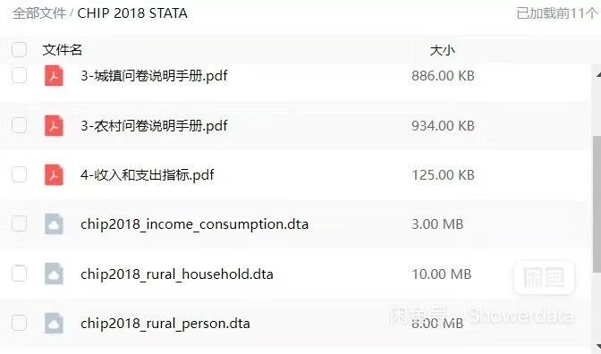

## Body

"中国家庭收入调查 CHIP数据" is a statistical survey of Chinese household incomes. The data spans from 1988 to 2018, with the first year of data collection starting in 1988. This dataset includes original high-reliability data integrated and a research report on social comprehensiveness, which has passed significant test. All data from the years when the survey started are included, including formatted in Stata and the original questionnaire.

## Images

Here is a pay link on Stripe ( https://buy.stripe.com/3cs8yP7sY87d0vu9AB ). Please contact me lonlonago@foxmail.com after funding $89, and I will send you a complete data files , thank you!

